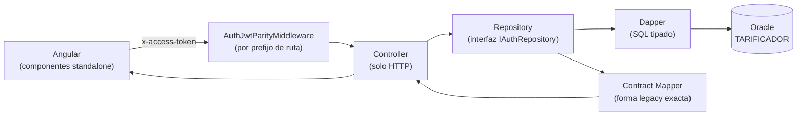
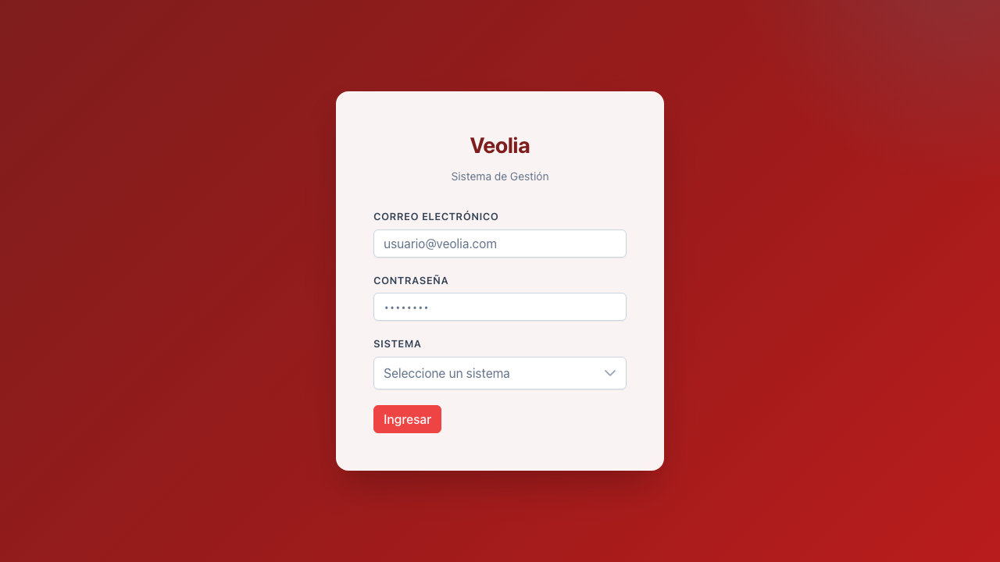
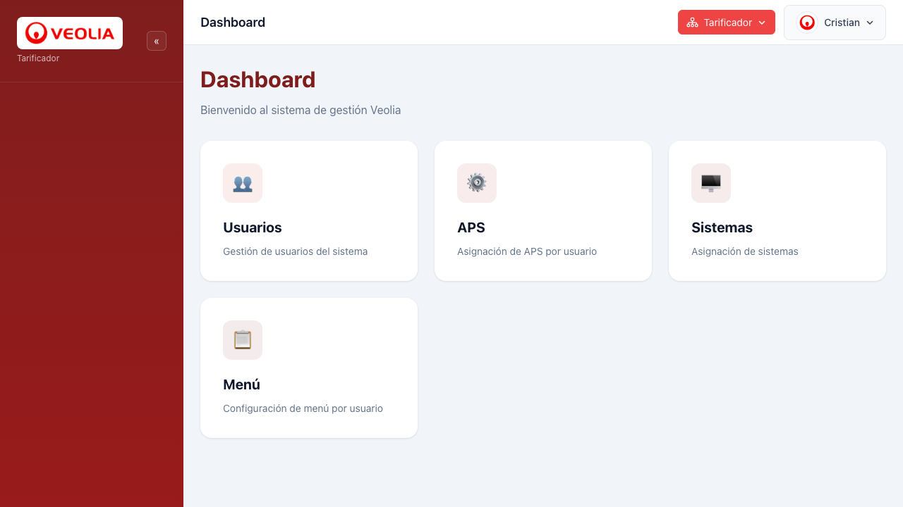
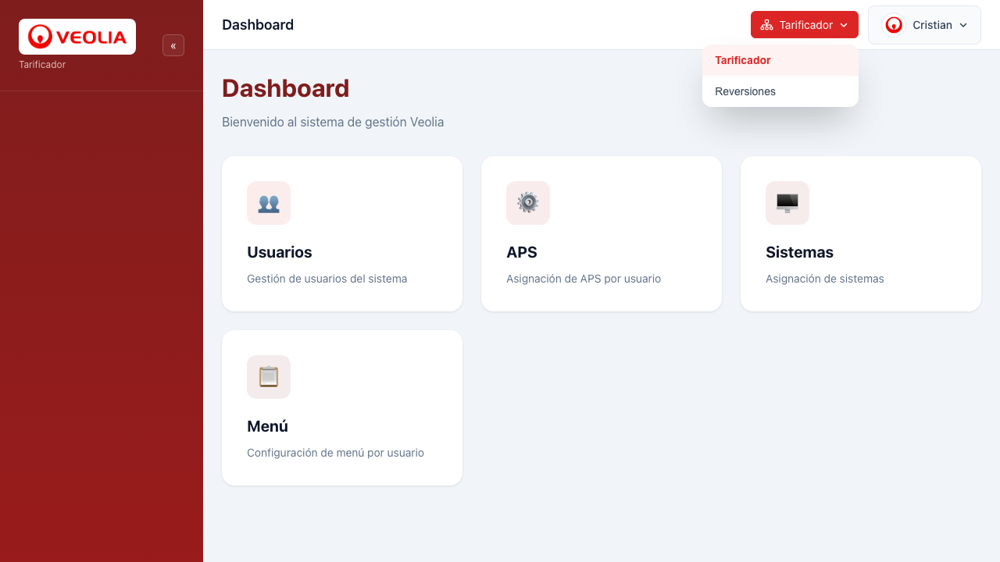
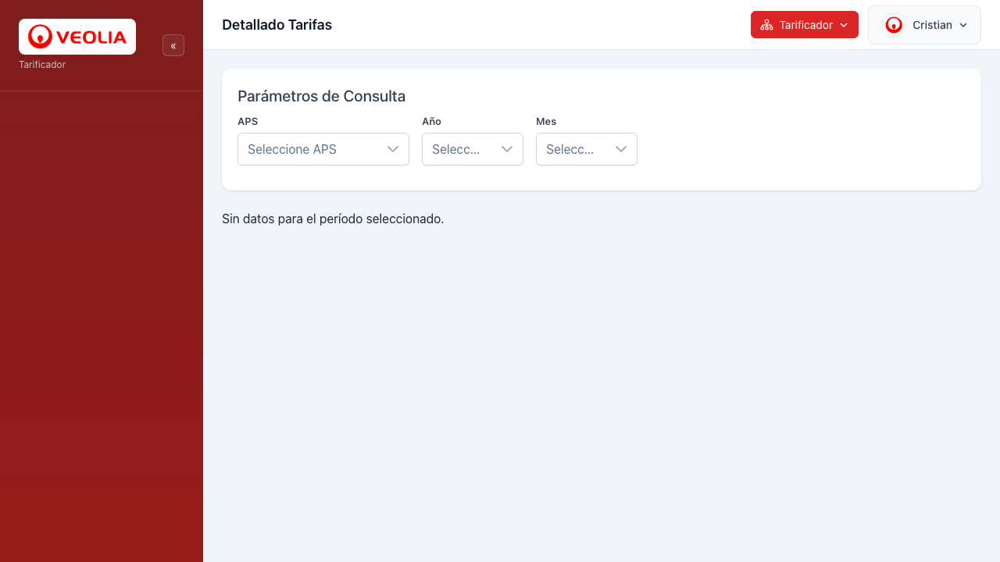
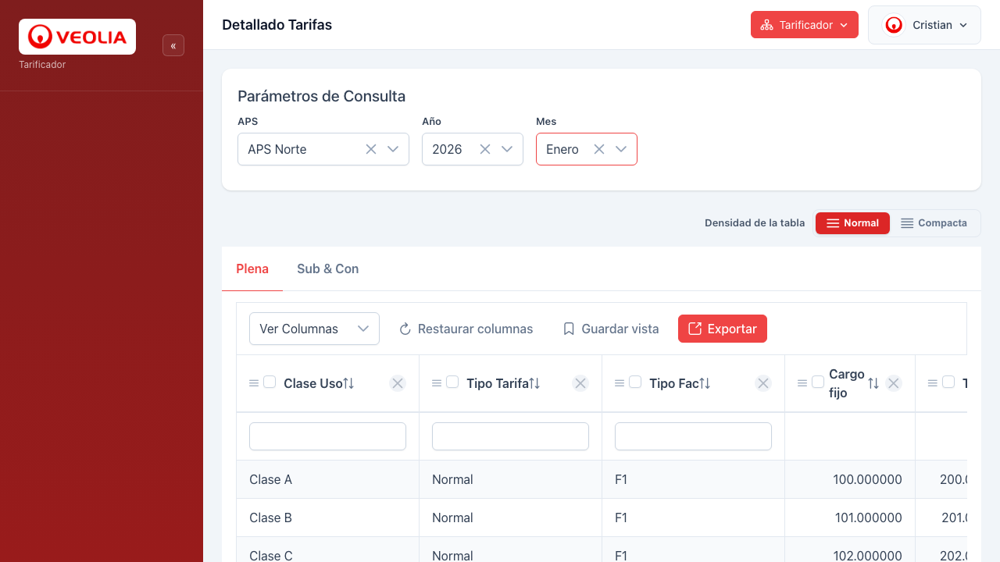
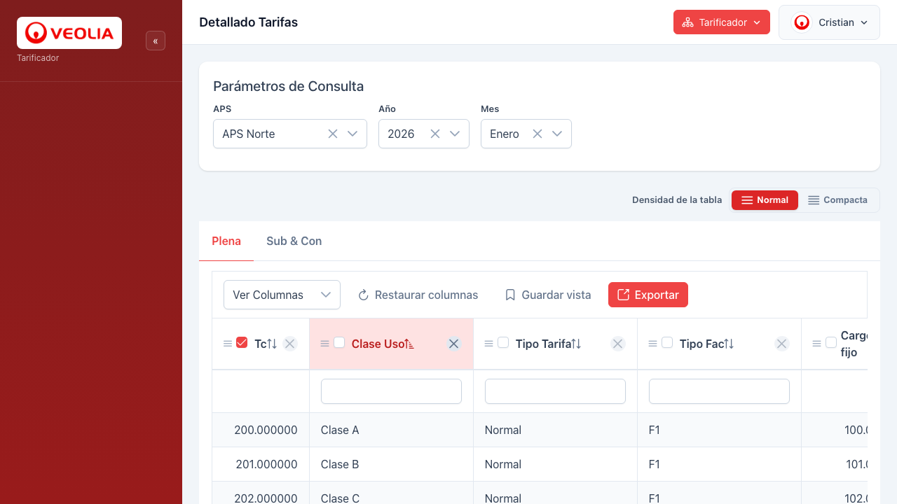
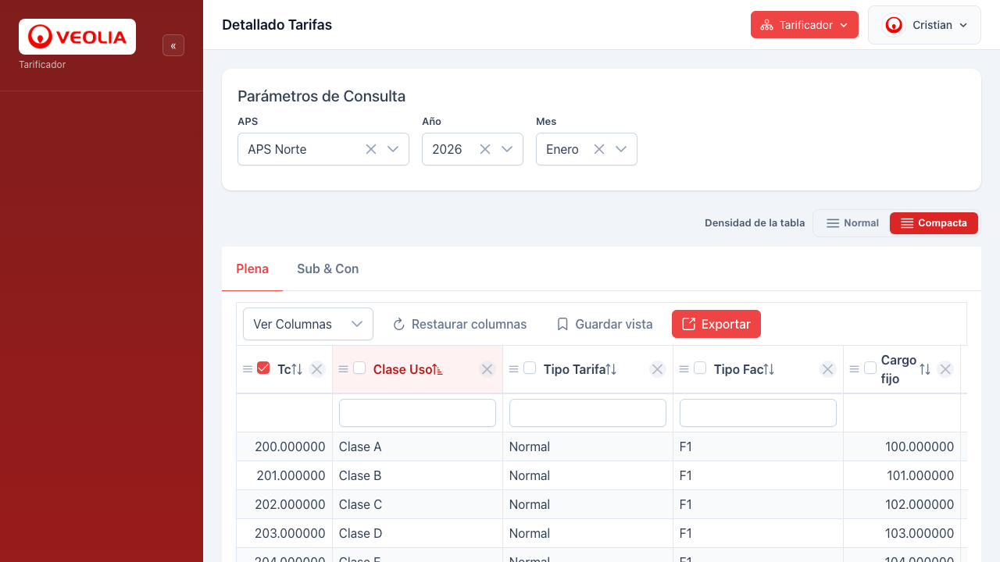
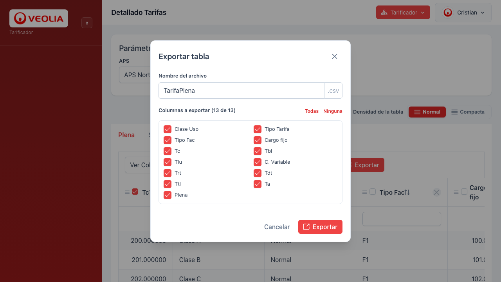
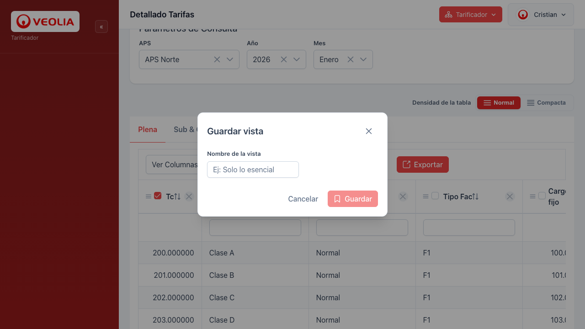

# Exposición técnica — Migración Veolia (Vue/Node.js/Oracle → Angular/.NET/Oracle)

## 1. Con qué nos peleamos

### 1.1 Punto de partida: solo lectura sobre la DB Oracle legacy
No se puede tocar el esquema (`TARIFICADOR`) — todo el trabajo fue reingeniería inversa a partir del DDL real, sin modificar una sola tabla. Esto obligó a documentar cada módulo como "AS-IS" (SQL, columnas, joins) antes de escribir una sola línea de C#.

### 1.2 El modelo de permisos legacy no tiene roles
No existe una tabla `ROL` ni `PERMISO` genérica. Los permisos son 3 ejes independientes, cada uno con su propia tabla de join:
- Acceso a sistema (`AUGE_USUASISTEMA`)
- Acceso a menú/feature (`AUGE_USUAMENU`)
- Acceso a APS (tabla propia)

Toda la migración de Usuarios/Permisos tuvo que respetar esa estructura tal cual, no un modelo RBAC "limpio".

### 1.3 Bugs reales encontrados por comparar contra el DDL real
- El login fallaba con `SISU_PASSWORD` en la query cuando la columna real es `SISU_PASS` — un bug de paridad que solo aparece corriendo contra el schema real.
- Error de conexión Oracle `ORA-01017`: el connection string apuntaba a `FREE` (la CDB raíz) en vez de `FREEPDB1` (la PDB donde vive el usuario de la app) — un gotcha de arquitectura multi-tenant de Oracle 23c.

### 1.4 JWT reimplementado a mano para paridad exacta con el sistema viejo
En vez de usar una librería de JWT estándar, el token se firma manualmente (HS256) para calzar byte a byte con cómo lo leía el middleware Node.js legacy — incluyendo el mecanismo de "token muerto" (`AUGE_DEADTOKEN`) para logout (blacklist, no expiración real del lado del servidor).

### 1.5 Extender esa arquitectura de auth con una feature nueva real
Cambio de sistema sin cerrar sesión: como el JWT viene atado a un `idSistema` desde el login, hubo que agregar un endpoint nuevo que re-emite el token para el sistema elegido, validando que el usuario tenga acceso — no era trivial resolverlo solo del lado del cliente.

### 1.6 Verificar sin acceso a la Oracle real
Como el Oracle de producción no es alcanzable desde el entorno de desarrollo, la verificación de UI se hizo con Playwright headless + mockeo de las rutas del backend — permitió encontrar y corregir bugs de front (loops de change detection de Angular, offsets de columnas fijas de PrimeNG) sin depender de la base real.

---

## 2. Lo nuevo — qué innovamos

### 2.1 De componentes copy-pasteados a componentes reutilizables de verdad
El legacy (Vue) repetía el mismo bloque de selectores APS/Año/Mes en cada vista. Acá se armó `ParametrosConsultaComponent` una sola vez y se reusa en Tarifas, Cálculo, Reversiones. Mismo criterio con el diálogo de exportación (`ExportarTablaDialogComponent`): se arma una vez, cualquier tabla nueva del sistema lo conecta con 3 inputs.

### 2.2 Funcionalidades de tabla que el legacy nunca tuvo
El sistema viejo renderizaba tablas PrimeVue fijas: columnas estáticas, sin ordenar, sin ocultar, sin fijar. Se agregó de cero: reordenar por drag, ocultar columnas, fijar columnas (checkbox en el header), ordenar con clic, vistas guardadas en localStorage, densidad compacta — pensado para reutilizarse en cualquier tabla ancha del sistema.

### 2.3 Cambiar de sistema sin cerrar sesión
En el legacy, cambiar de módulo significaba logout completo y volver a loguearse. Ahora el usuario elige el sistema desde un selector en el top-bar y el backend le emite un token nuevo al instante.

### 2.4 Identidad visual centralizada
Todo el theming de marca sale de un solo lugar (`definePreset` de PrimeNG) — cambiás un token y se propaga a botones, tabs, checkboxes, focus, paginación de toda la app. En el legacy eso hubiera significado tocar CSS disperso por cada vista.

### 2.5 Stack tipado de punta a punta
Backend en C#/.NET con DTOs tipados (records) y Dapper, frontend en Angular/TypeScript con componentes standalone — contra un legacy en Node.js/Vue con JS más suelto. Se traduce en errores de contrato que el compilador atrapa antes de llegar a producción — así se encontró el bug de `SISU_PASSWORD` vs `SISU_PASS` sin que fallara primero en el usuario final.

### 2.6 Verificación real antes de dar por terminada una feature
Cada funcionalidad se probó en vivo (Playwright + mock del backend) antes de decir "listo" — no "lo escribí y debería andar".

---

## 3. Arquitectura del sistema

### Qué arquitectura tenemos

No es un Clean Architecture de manual (no hay una capa de dominio/entidades separada ni casos de uso explícitos) — es algo más honesto de nombrar: una **arquitectura en capas con inversión de dependencias en el límite de acceso a datos**, aplicada de forma sistemática y repetida en **cada módulo del backend** (Auth, Aps, Empresas, Tarifas, Reversiones, Suministros — se confirma en `Program.cs`, cada uno registra su propio `IXxxRepository` + `XxxContractMapper`). En espíritu es un patrón liviano de *Ports & Adapters*: la interfaz (ej. `IAuthRepository`) es el "puerto", la implementación con Dapper contra Oracle (`AuthRepository`) es el "adaptador".

### Arquitectura en capas, con la paridad legacy aislada en un solo lugar

**Frontend**: Angular con componentes *standalone* (sin NgModules monolíticos), separación clara entre componentes "tontos" reutilizables (`ParametrosConsultaComponent`, `ExportarTablaDialogComponent`, selectores de APS/Año/Mes) y componentes de página que orquestan lógica de negocio (`DetalleTarifasComponent`, `LayoutComponent`). Estado de auth manejado con **signals** de Angular (`AuthState`), no con RxJS Subjects sueltos por todos lados.

**Backend**: capas bien separadas:
```
Controller (solo HTTP)
   → Repository detrás de una interfaz (IAuthRepository)
      → Acceso a datos con Dapper (SQL tipado, sin ORM pesado)
         → Contract Mapper dedicado (AuthContractMapper)
```
El `Contract Mapper` arma la forma de respuesta EXACTA que espera el frontend legacy (`res.send(resultado)` crudo, nombres de campo heredados). Esa "rareza" de compatibilidad queda contenida ahí — el resto del código de negocio no sabe ni le importa que existe un legacy.



**Testabilidad de fábrica**: como todo depende de interfaces (`IAuthRepository`), en los tests se inyecta un `StubAuthRepository` en vez de la Oracle real — la suite de contratos (`AuthContractSmokeTests`) corre sin necesitar la base de datos levantada.

**Seguridad por capas transversales, no hardcodeada por controller**: el middleware de JWT (`AuthJwtParityMiddleware`) se aplica selectivamente por prefijo de ruta (`app.UseWhen`), así cada módulo declara qué rutas son públicas y cuáles no, en un solo lugar centralizado — no repetido método por método.

### Cómo funciona, con un caso real: cambio de sistema de punta a punta

1. El navegador manda `POST /api/v1/auth/switchSistema` con el header `x-access-token`.
2. `AuthJwtParityMiddleware` intercepta antes de llegar al controller — verifica firma HMAC y que el token no esté en la blacklist (`AUGE_DEADTOKEN`). Si falla, corta ahí; el controller ni se entera.
3. `AuthController.SwitchSistema` no sabe nada de SQL ni de Oracle — solo lee el `SisuId` del token y delega a `authRepository.SwitchSistemaAsync(...)`, una **interfaz**, no una clase concreta.
4. `AuthRepository` (la implementación real, inyectada por DI) valida contra `AUGE_USUASISTEMA`/`AUGE_SISTEMA` que el usuario tenga acceso, y firma un token nuevo.
5. El resultado vuelve al controller como un objeto interno — todavía no tiene la forma que espera el frontend.
6. `AuthContractMapper.MapSwitchSistemaSuccess` recién ahí le da la forma final (`{status, message, auth_token, sistema}`) que el cliente entiende.

### Por qué funciona y para qué sirve, en la práctica

- **El controller nunca supo que existía Oracle.** Solo conoce una interfaz. Si mañana cambia el motor de base de datos o se necesita cachear, se reemplaza `AuthRepository` sin tocar el controller.
- **Se puede testear sin la base real.** Los tests inyectan `StubAuthRepository` en el mismo lugar donde va `AuthRepository` — por eso la suite de contratos corre sin Oracle levantado.
- **La compatibilidad con el sistema viejo vive en un solo archivo por módulo.** Toda la "rareza" legacy (`res.send(resultado)` crudo, nombres de campo heredados) está en el Mapper — el resto del código no necesita saber que hay un sistema viejo detrás.
- **Se puede extender sin romper nada existente** — el ejemplo más concreto que tenemos: se agregó el endpoint de cambio de sistema sin tocar una sola línea de `LoginAsync`, del `AuthController` original o del middleware — solo se sumó una interfaz nueva, una implementación nueva y un mapper nuevo, siguiendo la misma convención que ya existía.

---

## 4. Qué nos permite .NET/Angular que no nos permitía Express/Node 16 + Vue 2

Versiones confirmadas antes de afirmar nada: legacy backend en Express `4.17.1` sobre Node (no se encontró un `engines.node` explícito para confirmar la versión puntual del runtime, pero las dependencias —Express 4.17, `jsonwebtoken` 8.5, Webpack 4— son consistentes con esa época); legacy frontend en Vue `2.6.11` + Vuex 3 + Vue Router 3. Stack nuevo: `.NET 10` y `Angular 21`.

### Backend: Express/Node → .NET 10

1. **Tipado real en compilación, no en runtime.** Express es JS sin tipos — un campo mal escrito en un DTO explota recién cuando corre (literal lo que pasó con `SISU_PASSWORD` vs `SISU_PASS`, invisible hasta ejecutar contra la DB real). En .NET los request bodies son `record` tipados (`LoginRequest(string correo, string pass, int idSistema)`) — el compilador rechaza el error antes de correr una sola vez.

   ```js
   // Express (legacy) — sin tipos, el error se descubre en runtime
   router.post('/login', async (req, res) => {
     const { correo, pass, idSistema } = req.body; // req.body: any
     const user = await db.query(
       'SELECT * FROM AUGE_SISUSUARIO WHERE SISU_PASSWORD = :pass', // columna que no existe
       [pass]
     );
   });
   ```

   ```csharp
   // .NET — el compilador exige el contrato antes de correr
   public sealed record LoginRequest(string correo, string pass, int idSistema);

   [HttpPost("login")]
   public async Task<IActionResult> Login([FromBody] LoginRequest request, CancellationToken ct)
   {
       var result = await authRepository.LoginAsync(request.correo, request.pass, request.idSistema, ct);
       // request.pass mal tipeado o ausente => no compila
   }
   ```

2. **Inyección de dependencias nativa.** Express no trae DI de fábrica — normalmente se instancia todo a mano. .NET la tiene incorporada (`AddScoped<IAuthRepository, AuthRepository>()`), por eso se pudo testear con un `StubAuthRepository` sin tocar el código de producción ni levantar Oracle.

3. **Concurrencia real vs event loop único.** Node 16 es single-threaded — un cálculo pesado (reliquidaciones, tarifas) bloquea todo el proceso. .NET tiene thread pool real con async/await tanto para I/O como para CPU-bound, mejor uso de multi-core.

4. **Un matiz honesto sobre JWT.** El legacy ya usaba `jsonwebtoken` (librería madura), no algo casero. La migración decidió reimplementar el firmado a mano en C# para garantizar paridad byte a byte con el formato que el middleware viejo esperaba — no es que .NET "no tuviera" una librería de JWT (tiene `System.IdentityModel.Tokens.Jwt`), es una decisión deliberada de compatibilidad transitoria.

### Frontend: Vue 2 → Angular 21

1. **Reactividad por Signals vs getters/setters.** Vue 2 detecta cambios con `Object.defineProperty` — tiene límites conocidos y documentados (no detecta agregar/quitar propiedades ni cambios de índice de array sin `Vue.set`). Angular con Signals (`AuthState` usa `signal()`/`computed()`) es reactividad explícita de grano fino, sin esas trampas.

2. **Vue 2 está en End-of-Life desde diciembre 2023** — no recibe más parches de seguridad del core team. Angular 21 tiene soporte activo.

3. **Componentes standalone sin necesidad de módulos globales** — así se pudo armar `ParametrosConsultaComponent`/los diálogos como piezas aisladas reutilizables; en Vue 2 eso pasa por mixins o plugins registrados globalmente, más acoplado.

4. **TypeScript de punta a punta desde el día uno** — Vue 2 soporta TS pero de forma más forzada (el soporte de primera clase llegó con Vue 3).

5. **PrimeVue (legacy, atado a Vue 2) vs PrimeNG 21** — el sistema de theming por tokens de diseño es lo que permitió recolorear toda la app cambiando un solo archivo (`definePreset`).

---

## 5. Capturas de pantalla (estado real, verificado con Playwright)

Todas tomadas contra el sistema corriendo, no son mockups. Carpeta: `doc migracion/capturas/`.

### Identidad visual y navegación

*Punto 2.4 — theming centralizado en un solo token.*


*Logo real de Veolia en el sidebar, nombre del sistema activo, botón de cambio de sistema y perfil en el top-bar.*


*Punto 2.3 — cambio de sistema sin cerrar sesión.*

### Consulta y tabla de datos

*Punto 2.1 — `ParametrosConsultaComponent`, un solo componente reusado en varias pantallas.*


*Vista general: densidad, vistas guardadas, columnas configurables.*


*Punto 2.2 — columna "Tc" fijada (checkbox tildado, resaltada) + orden activo en "Clase Uso" + números alineados a la derecha.*


*Selector de densidad Normal/Compacta.*

### Diálogos reutilizables

*Punto 2.1 — `ExportarTablaDialogComponent`, mismo diálogo para cualquier tabla futura.*


*Mismo lenguaje visual que el modal de exportar — consistencia de diseño en toda la app.*
